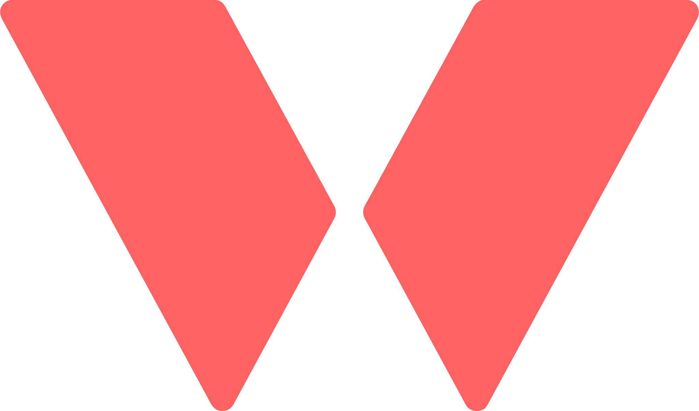

<p align="center">
  
</p>

# Verxion Native

An open-source iOS client for [Verxion](https://verxion.app). Built in public —
I post updates on [X (@_rbart_)](https://x.com/_rbart_).

    

Verxion is agent-first: you create routines, log workouts, and plan nutrition by
talking to ChatGPT or Claude, which even renders a rich set of widgets back to
you.

This client is for where the agents don't reach yet. Some of it they can't —
reading your Apple Health data, a notification at the right moment. Some of it's
fidelity: a widget can summarize a session, but it can't put you inside a workout
as it happens, set by set.

This is the part that lives on your phone.

> [!IMPORTANT]
> Early, and built in public. The foundation — architecture, auth, design system
> — is in. The screens are arriving one tab at a time. [See what's live →](#status)

## What it is

A calm place to look at your training: today at a glance, your progress over
time, a workout as it happens.

I also wanted it to be worth reading. Clean Architecture, strict types, a real
test suite. If you'd rather build your own Verxion client, you have somewhere
sensible to start.

## Two ways to use it

Sign in with your Verxion account and follow your training on the go. App Store
distribution comes with Verxion v1.

Or build your own. When Verxion Platform v1 ships you'll be able to mint API keys
and point a custom client at the API. Fork this, restyle it, make it yours.

> [!NOTE]
> This is the client only — no backend. Point it at a Verxion API with
> `EXPO_PUBLIC_API_URL`.

## Screenshots

Soon. <!-- today · progress · live session -->

## What it'll do

One tab at a time:

- **Today** — a daily score across training, nutrition, water, steps, and
  supplements, with a timeline of your day
- **Live session** — follow a workout as it happens, set by set
- **Progress** — overview, body composition, exercises, trends, records,
  timeline, weeks and months
- Dark by default, English and Spanish, native charts

## Built with

| | |
|---|---|
| Framework | Expo SDK 56 |
| Navigation | Expo Router v5 |
| Styling | NativeWind v4 |
| Server state | TanStack Query v5 |
| Auth | Better Auth |
| Charts | victory-native + Skia |

The architecture is Clean Architecture + DDD. Dependencies point inward:

```
domain ← application ← infrastructure ← presentation ← app/
```

Every read and write goes Route → Screen → Hook → Use Case → Repository → API.
HTTP lives only in repositories; the UI never touches it. The rules are in
[`.claude/rules/architecture.md`](.claude/rules/architecture.md).

## Running it

You'll need Node 20+ and the Expo tooling. iOS only, and a development build (no
Expo Go).

```bash
npm install
cp .env.example .env   # set EXPO_PUBLIC_API_URL
npx expo start
```

Everything goes to `${EXPO_PUBLIC_API_URL}/api/v1/*`. Auth is a Better Auth
session cookie, stored on device.

## Structure

```
src/
  domain/          # types: models and ports
  application/     # use cases, one per operation
  infrastructure/  # repositories, DI, auth, i18n
  presentation/    # screens, components, hooks
app/               # routes, kept thin
```

```bash
npm run lint
npm run typecheck
npm test
```

## Status

Pre-release, built in public. The foundation is in — the architecture, auth
(Apple, Google, and reviewer access), and the design system. Screens follow one
at a time.

- [x] Auth
- [ ] Today
- [ ] Training
- [ ] Nutrition
- [ ] Progress
- [ ] Live session

Later: HealthKit and Health Connect, push notifications, the App Store (with
Verxion v1), your own API keys, Android.

## Contributing

Issues and PRs are welcome. Please run lint, typecheck, and the tests first.

## License

[Apache 2.0](LICENSE) — use it, change it, ship your own client.

The name, logo, and brand aren't part of the license (Section 6). If you ship
your own, give it your own name.
